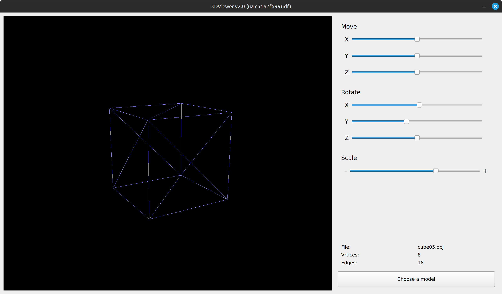

# 3DViewer

## Описание

Приложение для просмотра 3D-моделей в каркасном виде. Разработано на **C++** и **QT**.

## Возможности

- **Загрузка моделей:** приложение поддерживает формат obj.
- **Интерактивное управление моделью:**
	- Вращение
	- Перемещение по сцене
	- Мастабирование

## Сборка и запуск

Приложение разработано в **dev-контейнере**. Для запуска необходим **VS Code** и установленным расширением **Dev Containers**.

1. Запустите контейнер
2. В контейнере пропишите `cmake -B build`
3. После сборки пропишите `make -C build 3dviewer.out`
4. Запустите приложение командой `build/3dviewer.out`

В папке **obj** содержится несколько готовых моделей. Выберете их, нажав на кнопку **Choose a model**.

## Архитектура проекта:

Проект разработан в соответствии с паттерном **MVC**.

- **Model:** содержит классы вершин, ребер и модели. Также включает в себя парсер obj-файлов.
- **View:** desktop-интерфейс. Отображает данные, которые хранит модель. Принимает сигналы от пользователя и передает их на контроллер.
- **Controller:** принимает сигналы с представления и вызывает необходимые методы модели. Уведомляет представление об изменившимся состоянии моддели.

## Парсер

Частью приложения является парсер obj-файлов. В процессе парсинга, он преобразует данные в формат, необходимый приложению. Если в obj-файле описаны поверхности, парсер преобразует описание поверхностей в описание ребер.